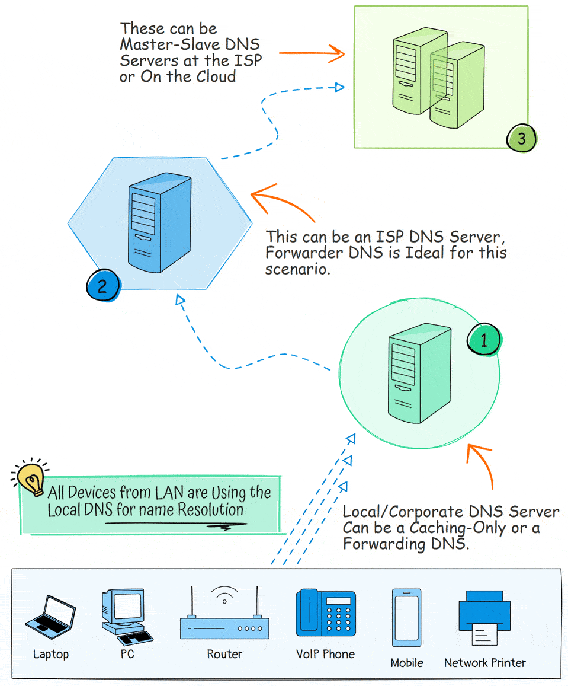
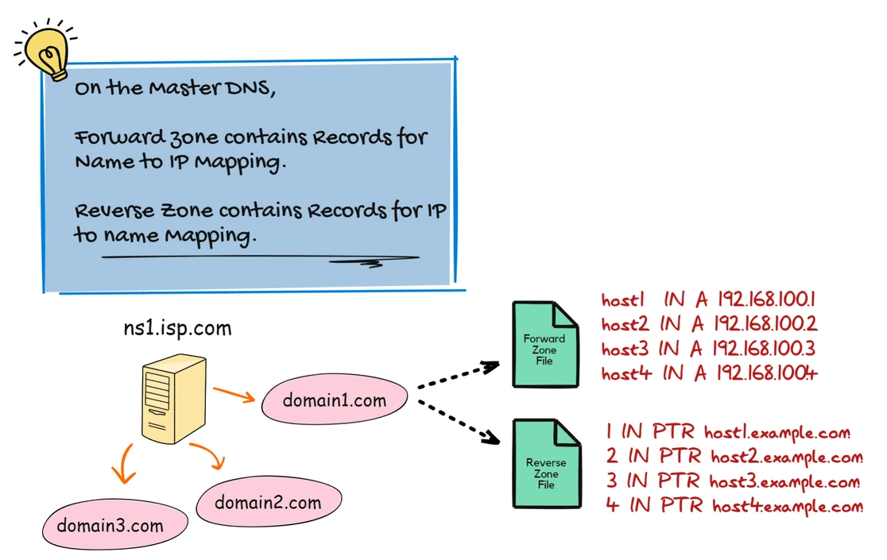
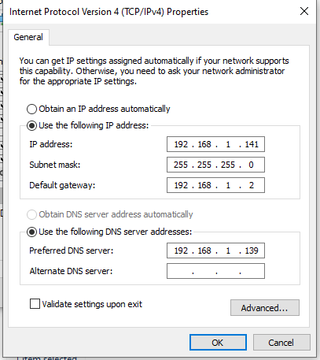
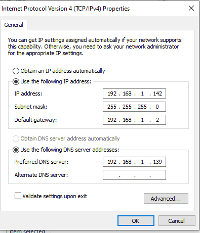

# DNS
DNS is a system that translates domain names to IP addresses. This is necessary because, although domain names are easy for people to remember, computers or machines, access websites based on IP addresses.

### Target of DNS
- DNS is used to resolve domain names to IP addresses and vice versa.
- Boost the performance of the network by caching DNS records.
- Block or direct access to specific websites.
  - Can be used to block access to specific websites by redirecting the domain name to a different IP address.
  - Companies can use DNS to block access to social media websites during working hours.
- security
  - DNS over HTTPS (DoH) or Dns over TLS (DoT) can be used to encrypt DNS queries and responses.

### Types of DNS
1. Primary DNS server - The primary DNS server is the first server that is queried when a domain name is resolved.
2. Secondary DNS server - The secondary DNS server is the backup server that is queried if the primary DNS server is unavailable.
3. Caching DNS server - The caching DNS server is used to cache DNS records to improve the performance of the network.
4. Forwarding DNS server - The forwarding DNS server is used to forward DNS queries to another DNS server.

### How DNS works


The way DNS works is as follows:
1. One of the devices on the local network sends a request to the **local DNS server** to resolve a domain name.
2. Local DNS server checks its cache to see if it has the IP address of the domain name.
   - If the IP address is found in the cache, the local DNS server returns the IP address to the device.
   - If the IP address is not found in the cache, the local DNS server sends a request to the ISP's DNS server to resolve the domain name.
3. The ISP's DNS server checks its cache to see if it has the IP address of the domain name.
   - If the IP address is found in the cache, the ISP's DNS server returns the IP address to the local DNS server.
   - If the IP address is not found in the cache, the ISP's DNS server sends a request to the root DNS server to resolve the domain name.
4. The root DNS server returns the IP address of the top-level domain (TLD) server to the ISP's DNS server.
5. The ISP's DNS server sends a request to the TLD server to resolve the domain name.

### Primary DNS server
A primary DNS server is the authoritative for a specific domain name. The primary DNS server is responsible for storing the DNS records for the domain name.

#### DNS zone and Zone files
A DNS zone is a distinct part of a domain namespace, like "example.com", within this zone, you can create sub-zones, like "marketing.example.com" or "sales.example.com".
Each zone has a zone file that contains the DNS records for the domain name, such as:
- A records - Maps a domain name to an IP address.
- CNAME records - Maps a domain name to another domain name.
- MX records - Maps a domain name to a mail server.
- NS records - Maps a domain name to a name server.
When a DNS client requests a record the server retrieves the information from the zone file and returns it to the client.


#### DNS Query
A DNS query is a request for information from a DNS server. There are two types of DNS queries:
1. forward DNS query - A forward DNS query is a request for the IP address of a domain name.
2. reverse DNS query - A reverse DNS query is a request for the domain name of an IP address.

For each zone, the primary DNS server maintains two zone files: one for the forward lookup zone and one for the reverse lookup zone.

When a DNS server replies to a query, the response can be classified into two types:
1. Authoritative response - DNS authoritative response is a response from a DNS server that is authoritative for the domain name.
2. Non-authoritative response - This response is from a DNS server that doesn't host the zone but has cached the result from a previous lookup. It doesn't hold the official records but temporarily stores them.

#### Configuring Primary DNS server
1. Install `bind9` package
```bash
apt update -y && apt upgrade -y
apt install bind9 bind9utils -y
```
The bind9 DNS server configuration files are located in the `/etc/bind/` directory.
``` js
ls -al /etc/bind
total 64
drwxr-sr-x   2 root bind  4096 Mar  2 04:13 .
drwxr-xr-x 136 root root 12288 Mar  2 04:13 ..
-rw-r--r--   1 root root  2403 Jan 28 09:30 bind.keys
-rw-r--r--   1 root root   237 Sep 23 17:16 db.0
-rw-r--r--   1 root root   271 Sep 23 09:35 db.127
-rw-r--r--   1 root root   237 Sep 23 09:35 db.255
-rw-r--r--   1 root root   353 Sep 23 09:35 db.empty
-rw-r--r--   1 root root   270 Sep 23 09:35 db.local
-rw-r--r--   1 root bind   463 Sep 23 17:16 named.conf
-rw-r--r--   1 root bind   498 Sep 23 09:35 named.conf.default-zones
-rw-r--r--   1 root bind   165 Sep 23 09:35 named.conf.local
-rw-r--r--   1 root bind   846 Sep 23 09:35 named.conf.options
-rw-r-----   1 bind bind   100 Mar  2 04:13 rndc.key
-rw-r--r--   1 root root  1317 Sep 23 09:35 zones.rfc1918
```
3. Explaining the configuration files:
Bind DNS server's main configuration file is `/etc/bind/named.conf`. But we will not directly edit this file.it includes other configuration files we needs to work with.
- `named.conf` file appears as follows:
```java
cat /etc/bind/named.conf
// This is the primary configuration file for the BIND DNS server named.
//
// Please read /usr/share/doc/bind9/README.Debian.gz for information on the 
// structure of BIND configuration files in Debian, *BEFORE* you customize 
// this configuration file.
//
// If you are just adding zones, please do that in /etc/bind/named.conf.local

include "/etc/bind/named.conf.options";
include "/etc/bind/named.conf.local";
include "/etc/bind/named.conf.default-zones";
```
There are three configuration files included in the `named.conf` file:
- `/etc/bind/named.conf.options` - In this file We provide Linux DNS server configuration parameters, how DNS server will be have, ACL, Forwarders, directory, etc.
- `/etc/bind/named.conf.local` - In this file, we define the zones, forward zone, reverse zone, if this DNS server maintains muilple zones, we need to define each zone in this file.
- `/etc/bind/named.conf.default-zones` - This file contains the default zones that are included in the BIND configuration.

To configure the primary DNS server properly we work with each of these files.

4. Configure DNS server options
The first we need to configure the DNS server with essential parameters. The configuration file is `/etc/bind/named.conf.options`.
The default configuration file looks like this:
```js
cat /etc/bind/named.conf.options
options {
	directory "/var/cache/bind";

	// If there is a firewall between you and nameservers you want
	// to talk to, you may need to fix the firewall to allow multiple
	// ports to talk.  See http://www.kb.cert.org/vuls/id/800113

	// If your ISP provided one or more IP addresses for stable 
	// nameservers, you probably want to use them as forwarders.  
	// Uncomment the following block, and insert the addresses replacing 
	// the all-0's placeholder.

	// forwarders {
	// 	0.0.0.0;
	// };

	//========================================================================
	// If BIND logs error messages about the root key being expired,
	// you will need to update your keys.  See https://www.isc.org/bind-keys
	//========================================================================
	dnssec-validation auto;

	listen-on-v6 { any; };
};
```
- We need provide the parameters to run the Primary DNS server with minimum configuration.
```js
acl local-network {
	192.168.1.0/24
};

options {
	directory "/var/cache/bind";

	// If there is a firewall between you and nameservers you want
	// to talk to, you may need to fix the firewall to allow multiple
	// ports to talk.  See http://www.kb.cert.org/vuls/id/800113

	// If your ISP provided one or more IP addresses for stable 
	// nameservers, you probably want to use them as forwarders.  
	// Uncomment the following block, and insert the addresses replacing 
	// the all-0's placeholder.

	// forwarders {
	// 	0.0.0.0;
	// };

	//========================================================================
	// If BIND logs error messages about the root key being expired,
	// you will need to update your keys.  See https://www.isc.org/bind-keys
	//========================================================================
	dnssec-validation auto;
	allow-query { localhost; local-network; };
	recursion yes;
	listen-on-v6 { none; };
	listen-on { 192.168.1.139; };
};
``` 
Here are the parameters we have configured:
- ACL: Defines a list of IP addresses that are allowed to query the DNS server.
- Directory: The directory where the DNS server stores its cache and zone files.
- dnssec-validation: Enables automatic DNSSEC validation for security.
- allow-query: Controls which clients can send DNS queries to the servers.
- forwarders: Defines upstream DNS servers to forward queries to.
- listen-on-v6: Configures whether the Primary DNS server should listen on IPv6 addresses.
- listen-on: Specifies the IPv4 address on which the DNS server listens for queries.

Now we need restart BIND after making changes to the configuration file.
```bash
systemctl restart bind9
```
Check the status of the BIND service to ensure it is running.
```js
systemctl status bind9
● named.service - BIND Domain Name Server
     Loaded: loaded (/lib/systemd/system/named.service; enabled; vendor preset: enabled)
     Active: active (running) since Mon 2025-03-03 02:59:53 EST; 1min 14s ago
       Docs: man:named(8)
    Process: 5822 ExecStart=/usr/sbin/named $OPTIONS (code=exited, status=0/SUCCESS)
   Main PID: 5823 (named)
      Tasks: 8 (limit: 4549)
     Memory: 5.9M
        CPU: 45ms
     CGroup: /system.slice/named.service
             └─5823 /usr/sbin/named -u bind

Mar 03 02:59:53 wazuh-vm named[5823]: network unreachable resolving './DNSKEY/IN': 2001:7fd::1#53
Mar 03 02:59:53 wazuh-vm named[5823]: network unreachable resolving './NS/IN': 2001:7fd::1#53
Mar 03 02:59:53 wazuh-vm named[5823]: network unreachable resolving './DNSKEY/IN': 2001:dc3::35#53
Mar 03 02:59:53 wazuh-vm named[5823]: network unreachable resolving './NS/IN': 2001:dc3::35#53
Mar 03 02:59:53 wazuh-vm named[5823]: managed-keys-zone: Key 20326 for zone . is now trusted (acceptance timer complete)
Mar 03 02:59:53 wazuh-vm named[5823]: checkhints: b.root-servers.net/A (170.247.170.2) missing from hints
Mar 03 02:59:53 wazuh-vm named[5823]: checkhints: b.root-servers.net/A (199.9.14.201) extra record in hints
Mar 03 02:59:53 wazuh-vm named[5823]: checkhints: b.root-servers.net/AAAA (2801:1b8:10::b) missing from hints
Mar 03 02:59:53 wazuh-vm named[5823]: checkhints: b.root-servers.net/AAAA (2001:500:200::b) extra record in hints
Mar 03 02:59:53 wazuh-vm named[5823]: managed-keys-zone: Key 38696 for zone . is now trusted (acceptance timer complete)
```
Check listening ports and socket
```js
sudo netstat -antp
Active Internet connections (servers and established)
Proto Recv-Q Send-Q Local Address           Foreign Address         State       PID/Program name    
tcp        0      0 127.0.0.53:53           0.0.0.0:*               LISTEN      612/systemd-resolve 
tcp        0      0 192.168.1.139:53        0.0.0.0:*               LISTEN      5823/named          
tcp        0      0 192.168.1.139:53        0.0.0.0:*               LISTEN      5823/named                   
```
5. Create DNS zone and zone files
We need create a forward lookup zone and a reverse lookup zone for the domain name.
We will create zone files under `/etc/bind/zones` directory. This is optional, but it is a good practice to keep the zone files in a separate directory.
Create the /etc/bind/zones directory and assign permissions
```bash
sudo mkdir /etc/bind/zones
sudo chown root:bind /etc/bind/zones
```
We configured two DNS zones "zone lab.com" is the forward zone for the domain "lab.com" and "zone.1.168.192.in-addr.arpa" is the reverse zone for the domain "192.168.1.0/24".

We also specificed the respective file localtions for oeach zone where their records will be stored.
```js
sudo nano /etc/bind/named.conf.local


zone "lab.com" {
    type master;
    file "/etc/bind/zones/forward.lab.com.db";
    allow-update { none; };
};

zone "1.168.192.in-addr.arpa" {
    type master;
    file "/etc/bind/zones/reverse.192.168.1.db";
    allow-update { none; };
};
```
Summary of the configuration:
- zone: Defines the zone name, either for a forward or reverse lookup zone.
- type: Specifies the type of zone, which can be master, slave, or stub.
- file: Specifies the location of the zone file that contains the DNS records.
- allow-update: Specifies the IP addresses that are allowed to update the zone. Setting it to none blocks all automatic changes, improving security.

6. Configure the forward lookup zone
Create DNS record for the devices on the network. We need to create the zone files. we will create two zone files on for the forward lookup zone and one for the reverse lookup zone.

We can easily create the zone files by copying the existing localhosts zone file and modifying it.
```bash
cd /etc/bind/
cp db.local /etc/bind/zones/forward.lab.com.db
```
- default forward lookup zone file looks like this:
```js
cat db.local 
;
; BIND data file for local loopback interface
;
$TTL	604800
@	IN	SOA	localhost. root.localhost. (
			      2		; Serial
			 604800		; Refresh
			  86400		; Retry
			2419200		; Expire
			 604800 )	; Negative Cache TTL
@       IN      NS      ns1.lab.com.

@	IN	NS	localhost.
@	IN	A	127.0.0.1
@	IN	AAAA	::1
```
- Now let modify the file `forward.lab.com.db` and create DNS records for the network devices.
```js
sudo nano /etc/bind/zones/forward.lab.com.db
;
; BIND data file for local loopback interface
;
$TTL	604800
@	IN	SOA	localhost. root.localhost. (
			      2		; Serial
			 604800		; Refresh
			  86400		; Retry
			2419200		; Expire
			 604800 )	; Negative Cache TTL
;
ns1	IN	A	192.168.1.139
pc1	IN	A	192.168.1.141
pc2	IN	A	192.168.1.142
pc3	IN	A	192.168.1.143
```
Key points of the above configuration:
- SOA Record: Defines the authoritative server and basic zone control parameters (serial, refresh, retry, etc.).
- NS Record: Point to the Linux DNS server (ns1.lab.com) responsible for the domain.
- A Records: Maps the domain names to IP addresses.

So , from noew on each device can communicate with each other using the domain names instead of IP addresses.

7. Configure the reverse lookup zone
Now lets create the reverse lookup zone allows for the resolution of IP addresses back to  hostnames.

We can copy the existing reverse lookup zone file and modify it.
```bash
cd /etc/bind/
sudo cp db.127 /etc/bind/zones/reverse.192.168.1.db
```
- Default reverse lookup zone file looks like this:
```js
sudo cat db.127 
;
; BIND reverse data file for local loopback interface
;
$TTL	604800
@	IN	SOA	localhost. root.localhost. (
			      1		; Serial
			 604800		; Refresh
			  86400		; Retry
			2419200		; Expire
			 604800 )	; Negative Cache TTL
;
@	IN	NS	localhost.
1.0.0	IN	PTR	localhost.
```
- Now let modify the file `reverse.192.168.1.db` and create DNS records for the network devices.
```js
sudo nano /etc/bind/zones/reverse.192.168.1.db 
;
; BIND reverse data file for local loopback interface
;
$TTL	604800
@	IN	SOA	localhost. root.localhost. (
			      1		; Serial
			 604800		; Refresh
			  86400		; Retry
			2419200		; Expire
			 604800 )	; Negative Cache TTL
@	IN	NS	ns1.lab.com.	; PTR Records for Reverse Lookup
;
139	IN	PTR	ns1.lab.com.
141	IN	PTR	pc1.lab.com.
142	IN	PTR	pc2.lab.com.
143	IN	PTR	pc3.lab.com.
```
Key points of the above configuration:
- Time to Live (TTL): $TTL 604800: Specifies the default time-to-live for DNS records, set to 604800 seconds (1 week).
- Start of Authority (SOA) Record: Indicates the authoritative name server (ns1.lab.com) and the email of the administrator (root.lab.com).
- Serial Number: Set to 1. This should be incremented with each update to the zone.
- Refresh, Retry, Expire, Negative Cache TTL: Standard parameters for DNS operations.
- Name Server (NS) Record: Designates ns1.lab.com as the authoritative name server for this reverse zone.
- Pointer (PTR) Records: PTR records maps IP to Hostnames, whereas A record maps hostname to IP.

now, the reverse query for the devices can return the hostnames as they are configured on the reverse zone.

***Disable bind service to listen on IPv6***
Default configuration of bind9 is to listen on both IPv4 and IPv6. If you want to disable IPv6, you can do so by editing the configuration file `/etc/default/bind9` and adding the following line:
```bash
sudo netstat -antp
Active Internet connections (servers and established)
Proto Recv-Q Send-Q Local Address           Foreign Address         State       PID/Program name    
tcp        0      0 127.0.0.1:631           0.0.0.0:*               LISTEN      923/cupsd           
tcp        0      0 0.0.0.0:443             0.0.0.0:*               LISTEN      846/node            
tcp        0      0 0.0.0.0:22              0.0.0.0:*               LISTEN      966/sshd: /usr/sbin 
tcp        0      0 127.0.0.1:953           0.0.0.0:*               LISTEN      952/named           
tcp        0      0 127.0.0.1:953           0.0.0.0:*               LISTEN      952/named           
tcp        0      0 0.0.0.0:1514            0.0.0.0:*               LISTEN      1978/wazuh-remoted  
tcp        0      0 0.0.0.0:1515            0.0.0.0:*               LISTEN      1886/wazuh-authd    
tcp        0      0 192.168.1.139:53        0.0.0.0:*               LISTEN      952/named           
tcp        0      0 192.168.1.139:53        0.0.0.0:*               LISTEN      952/named           
tcp        0      0 127.0.0.53:53           0.0.0.0:*               LISTEN      632/systemd-resolve 
tcp        0      0 0.0.0.0:55000           0.0.0.0:*               LISTEN      1824/python3        
tcp        0      0 127.0.0.1:60932         127.0.0.1:9200          ESTABLISHED 846/node            
tcp        0      0 127.0.0.1:36244         127.0.0.1:9200          ESTABLISHED 846/node            
tcp        0      0 127.0.0.1:60938         127.0.0.1:9200          ESTABLISHED 846/node            
tcp        0      0 127.0.0.1:37350         127.0.0.1:9200          ESTABLISHED 1054/filebeat       
tcp        0      0 127.0.0.1:36228         127.0.0.1:9200          ESTABLISHED 846/node            
tcp6       0      0 127.0.0.1:9200          :::*                    LISTEN      1063/java           
tcp6       0      0 :::22                   :::*                    LISTEN      966/sshd: /usr/sbin 
tcp6       0      0 ::1:631                 :::*                    LISTEN      923/cupsd           
tcp6       0      0 ::1:953                 :::*                    LISTEN      952/named           
tcp6       0      0 ::1:953                 :::*                    LISTEN      952/named           
tcp6       0      0 127.0.0.1:9300          :::*                    LISTEN      1063/java
```
- Disable IPv allow only IPv4
```bash
sudo nano /etc/default/named 
#
# run resolvconf?
RESOLVCONF=no

# startup options for the server

OPTIONS="-u bind -4"
```
Next Restart DNS service to apply the changes
```bash
sudo systemctl restart named
```
**DNS server Configuration and Syntax Check:**

We need to check our Linux DNS server configurations are valid, we need to do a systax check.
  1. Checking the Linux DNS Server configuration files for syntax errors.
```bash
named-checkconf /etc/bind/named.conf.local
named-checkconf /etc/bind/named.conf.options
```
for valid configuration it wont say anything, if any issue found, it will pop error messages.
  2. Checking Forward and Reverse zone files systax.
```bash
named-checkzone lab.com /etc/bind/zones/forward.lab.com.db
named-checkzone 1.168.192.in-addr.arpa reverse.192.168.1.db
```
```bash
named-checkzone lab.com /etc/bind/zones/forward.lab.com.db
zone lab.com/IN: loaded serial 2
OK
named-checkzone 1.168.192.in-addr.arpa /etc/bind/zones/reverse.192.168.1.db
zone 1.168.192.in-addr.arpa/IN: loaded serial 1
OK
```
The configuration files and zone files systax seems ok.

Now lets learn how to test Linux DNS server with various tools and techniques.

8. Testing Master DNS server
Linux DNS server Configuration is complete. Now we need to test the DNS server to ensure it is working correctly.

**Test #1: Test DNS Name Resolution Using Ping**


The first test is to check if the DNS server can resolve domain names to IP addresses.
```bash
C:\Users\PC1>nslookup pc2.lab.com
Server:  ns1.lab.com
Address:  192.168.1.139

Name:    pc2.lab.com
Address:  192.168.1.142

C:\Users\PC2>nslookup pc1.lab.com
Server:  ns1.lab.com
Address:  192.168.1.139

Name:    pc1.lab.com
Address:  192.168.1.141
```
To ping the domain name we need allow ICMP traffic on the firewall. Open CMD as administrator and run the following command.
```bash
netsh advfirewall firewall add rule name="ICMP Allow" protocol=icmpv4 dir=in action=allow
```
Now we can ping the domain name.
```js
C:\Users\PC1>ping pc2.lab.com
Pinging pc2.lab.com [192.168.1.142] with 32 bytes of data:
Reply from 192.168.1.142: bytes=32 time<1ms TTL=128
Reply from 192.168.1.142: bytes=32 time<1ms TTL=128
Reply from 192.168.1.142: bytes=32 time<1ms TTL=128
Reply from 192.168.1.142: bytes=32 time<1ms TTL=128

Ping statistics for 192.168.1.142:
    Packets: Sent = 4, Received = 4, Lost = 0 (0% loss),
Approximate round trip times in milli-seconds:
    Minimum = 0ms, Maximum = 0ms, Average = 0ms
```
```js
C:\Users\PC2>ping pc1.lab.com
Pinging pc1.lab.com [192.168.1.141] with 32 bytes of data:
Reply from 192.168.1.141: bytes=32 time<1ms TTL=128
Reply from 192.168.1.141: bytes=32 time<1ms TTL=128
Reply from 192.168.1.141: bytes=32 time<1ms TTL=128
Reply from 192.168.1.141: bytes=32 time=1ms TTL=128

Ping statistics for 192.168.1.141:
    Packets: Sent = 4, Received = 4, Lost = 0 (0% loss),
Approximate round trip times in milli-seconds:
    Minimum = 0ms, Maximum = 1ms, Average = 0ms
```


### Files and tools configuration
#### Files
- `/etc/resolv.conf` - This file contains the IP addresses of the DNS servers that the system uses to resolve domain names.
example:
```bash
nameserver 8.8.8.8    # Google DNS
nameserver 1.1.1.1    # Cloudflare DNS
```
- `/etc/nsswitch.conf` - Controls the order of the name resolution process.
example:
```bash
cat /etc/nsswitch.conf 
# /etc/nsswitch.conf
#
# Example configuration of GNU Name Service Switch functionality.
# If you have the `glibc-doc-reference' and `info' packages installed, try:
# `info libc "Name Service Switch"' for information about this file.

passwd:         files systemd
group:          files systemd
shadow:         files
gshadow:        files

hosts:          files mdns4_minimal [NOTFOUND=return] dns
networks:       files

protocols:      db files
services:       db files
ethers:         db files
rpc:            db files

netgroup:       nis
```
- `/etc/hosts` - This file contains the IP addresses and hostnames of the system.
example:
```bash
cat /etc/hosts
127.0.0.1	localhost
127.0.1.1	wazuh-vm

# The following lines are desirable for IPv6 capable hosts
::1     ip6-localhost ip6-loopback
fe00::0 ip6-localnet
ff00::0 ip6-mcastprefix
ff02::1 ip6-allnodes
ff02::2 ip6-allrouters
```
if access localhost , system will point to `127.0.0.1`

#### Tools
- `dig` - A command-line tool for querying DNS servers.
- `nslookup` - A command-line tool for querying DNS servers.
- `host` - A command-line tool for querying DNS servers.
- `whois` - A command-line tool for querying information about domain names.

### Configuring DNS
Install `bind9` package
```bash
sudo apt install bind9 -y
```
Install package for testing and troubleshooting DNS
```bash
sudo apt install dnsutils -y
```
Install package for DNS documentation
```bash
sudo apt install bind9-doc
```
